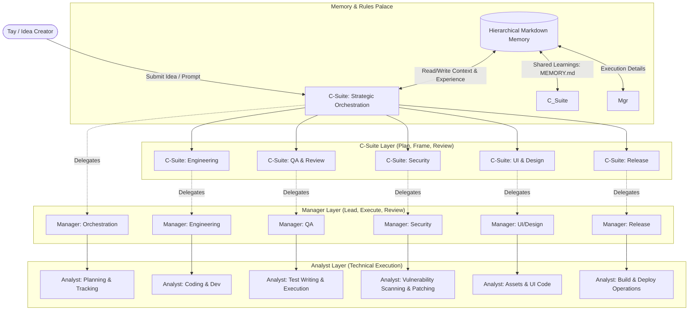

# Tay's Multi-Layered Autonomous Agent System (Grid-Orchestrator)

A robust, end-to-end multi-layered autonomous AI agent orchestrator designed for **Tay, a Strategy Consultant and AI/Solution Engineer**. This system translates concepts and ideas into high-fidelity production plans, code, and test systems across 6 target functional domains, operating via a 3-tier organizational hierarchy and driven by a growing, spatial `MEMORY.md` learning palace.

---

## 🏗️ System Architecture

The core of the system is structured as a **3x6 Agent Grid Matrix**, assigning clear levels of delegation, supervision, and execution across all key engineering and business operations.



---

## 👥 The 3-Tier Agent Hierarchy

Each of the 6 core domains operates using a strict, collaborative 3-layer pattern:

### Layer 1: The C-Suite Agent (Plan, Frame, and Review)
- **Objective**: Strategic vision, quality gates, and guideline enforcement.
- **Responsibility**: Formulates high-level master checklists, designs system blueprints, defines architectural patterns, and runs global validation engines (e.g., auditing designs against the 30 Laws of UX).

### Layer 2: The Manager Agent (Lead, Execute, and Review)
- **Objective**: Task planning, work breakdown, and draft review.
- **Responsibility**: Translates C-Suite objectives into concrete backlogs (`task.md` or roadmap milestones), assigns coding directions, monitors execution progress, and performs technical reviews.

### Layer 3: The Analyst Agent (Technical Execution)
- **Objective**: Foundational execution, coding, testing, and operation.
- **Responsibility**: Writes clean production code, implements specific business logic, designs mock objects and test files, executes scans, and deploys build pipelines.

---

## 🧠 Memory & Rules Architecture

The system coordinates rules and memories hierarchically to maintain domain awareness, learn from errors, and calibrate behavior to match your professional style.

```
[Target Workspace Root]
 ├── global_rules.md              # Global defaults, system guidelines, and style rules
 ├── MEMORY.md                     # Root-level learning repository (cross-project memory)
 ├── [workstation-name]/           # Workstation domain specialization (e.g., ui_design, engineering)
 │    ├── workstation_rules.md     # Domain-specific constraints and tools
 │    └── MEMORY.md                # Domain-level ledger of successful snippets and past bugs
 └── projects/
      └── [project-name]/          # Project folder for isolated, bounded work
           ├── project_rules.md    # Tailored rules + calibrated work principles
           └── MEMORY.md           # Project execution records and run logs
```

### Core Memory Mechanisms
1. **Rule Inheritance**: When an agent runs, it automatically loads rules in sequence: `Global Rules` $\rightarrow$ `Workstation Rules` $\rightarrow$ `Project Rules`. Local rules always override broader rules.
2. **Memory Accumulation & Write-Backs**: Critical errors or successful milestones are automatically logged in `projects/[project-name]/MEMORY.md` and elevated to the specific workstation `MEMORY.md` or global `MEMORY.md` to prevent similar failures in future runs.
3. **Behavioral Calibration**: The system analyzes existing work samples (code, specs, plans) to formulate visual guidelines, code style rules, and planning preferences, locking them directly into the project's rule card.

---

## 🎛️ Controller Interface CLI

Run project initialization, pipelines, UX audits, or behavior extractions using the command-line controller:

```bash
# 1. Initialize a Project
python run_agents.py init-project --project <name>

# 2. Run the 3x6 agent grid simulation pipeline
python run_agents.py run-pipeline --project <name> --query "High-level idea prompt"

# 3. Perform a UX audit against the 30 Laws of UX
python run_agents.py audit-ux --project <name> --query "Description of layout" --platform "Mobile|Web"

# 4. Extract custom guidelines from your work samples
python run_agents.py analyze-behavior --project <name> --query "path/to/sample_file.py"
```

---

## 🚦 System Verification

Run the automated test suite to verify rules loading, memory write-backs, and UX audit functionality:
```bash
python verify_system.py
```
