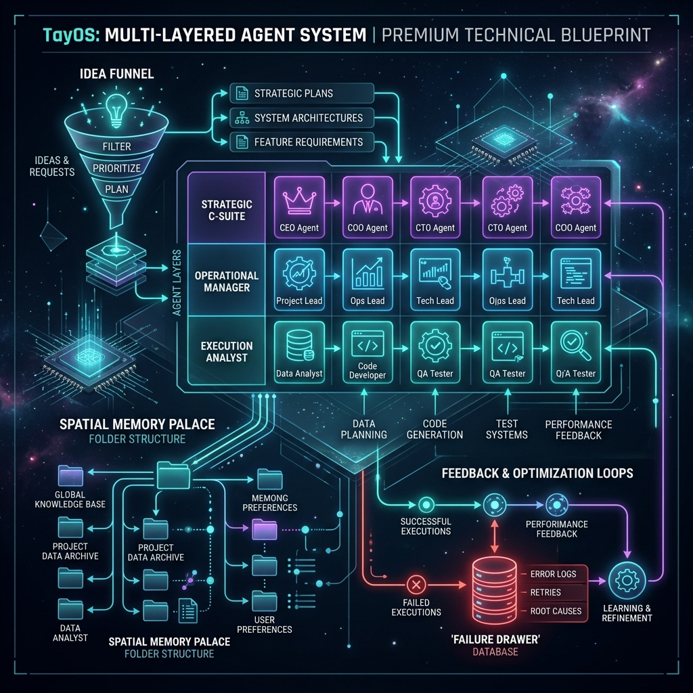
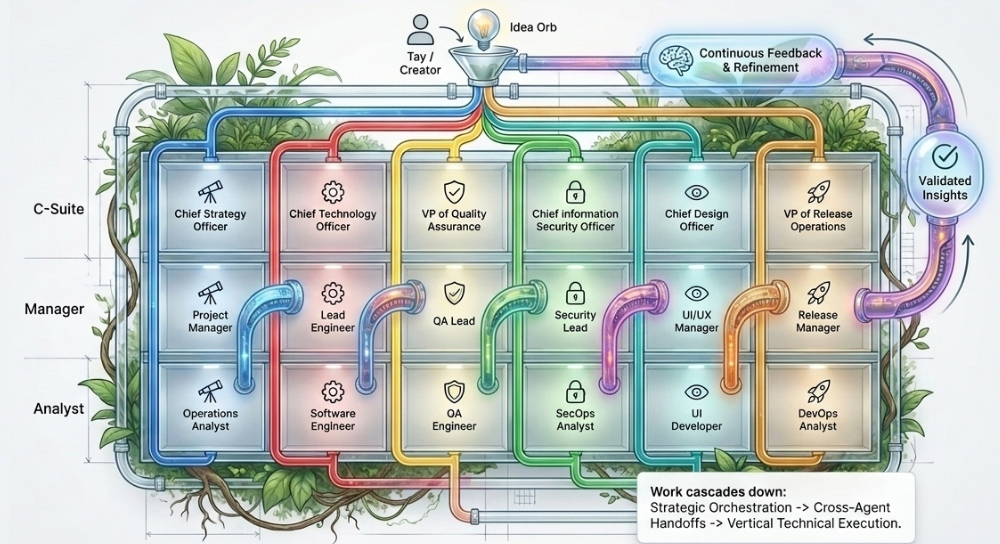
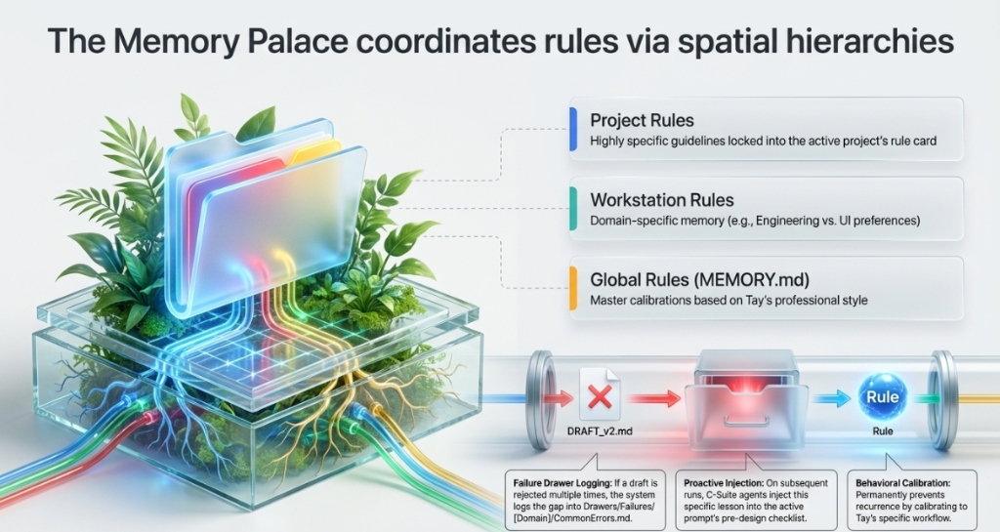
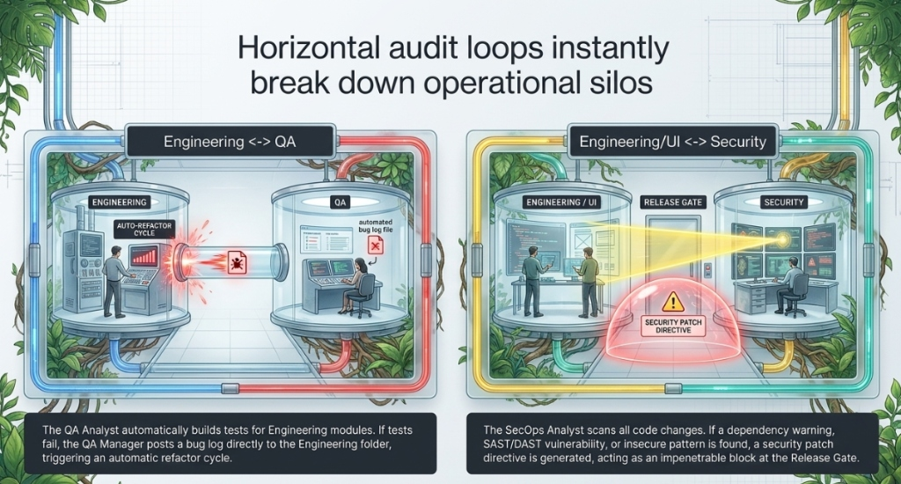
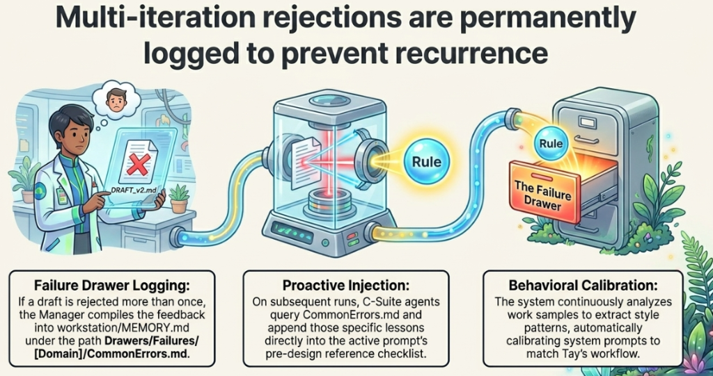

# TayOS: Multi-Layered Autonomous Agent System

Welcome to **TayOS**—a sophisticated, multi-layered autonomous AI agent orchestrator engineered specifically for **Tay, a Strategy Consultant and AI/Solution Engineer**. 



TayOS systematically translates raw technical and business concepts into high-fidelity production plans, clean typed code modules, and robust test suites. It operates via a 3-tier organizational hierarchy across 6 distinct functional domains, coordinate rules and lessons via a spatial Memory Palace hierarchy, and optimizes system quality through vertical and horizontal closed-loop audits.

---

## 🏗️ 1. System Architecture: The 3x6 Agent Grid Matrix

The core engine is structured as an interactive 3-tier grid separating planning, management, and technical execution across 6 specialized focus areas:



### Vertical Handoffs & Delegation Flow
Work cascades dynamically down the matrix:
1. **Layer 1: The C-Suite (Frame & Check)**: Formulates high-level ROI constraints, selects programming runtimes, defines system-wide guidelines (such as the 30 Laws of UX), and serves as the ultimate approval gate.
2. **Layer 2: The Manager (Lead & Review)**: Translates C-Suite rules into milestone backlogs (`task.md`), schedules handoffs, designs test scenarios, and conducts rigorous reviews of code drafts.
3. **Layer 3: The Analyst (Execute & Build)**: Writes raw modular code, compiles typing parameters, runs security static sweeps, develops responsive CSS sheets, and triggers deployment builds.

---

## 🧠 2. Memory & Rules Palace: Spatial Hierarchies

TayOS organizes constraints, styling conventions, and memories recursively through folders to guarantee maximum domain awareness and context preservation:



- **Global Rules (`global_rules.md`)**: Enforce typing strictness, DRY/SOLID coding patterns, first-principles logic documentation, and no placeholders system-wide.
- **Workstation Rules (`[domain]/workstation_rules.md`)**: Define specialized domain tools and target goals (e.g. CDO enforcing touch target sizes under the 30 Laws of UX; CISO enforcing directory traversal protection).
- **Project Rules (`projects/[name]/project_rules.md`)**: Bounded rule cards tailored to a specific project’s technical stack.

---

## 🔄 3. Closed-Loop Optimization & Audits

To ensure performance excellence, TayOS breaks down operational silos through continuous vertical and horizontal closed-loop audits:



- **Vertical Optimization Loops**: Analysts submit drafts to Managers $\rightarrow$ Managers audit drafts against the spec checklist. If gaps exist, a detailed `FEEDBACK.md` card is generated, and the loop transitions to a pulsing, amber `reviewing` state.
- **Horizontal Optimization Loops**: 
  - *Engineering $\leftrightarrow$ QA*: QA Analysts automatically compile unit tests against SWE modules. Any failed run writes bug files back to the Engineering workstation backlog.
  - *Engineering/UI $\leftrightarrow$ Security*: SecOps Analysts run SAST sweeps on code modifications. Dependency alerts or path leaks instantly block release tags at the Release Gate.

### 🗃️ Proactive Failure Prevention
If an optimization loop fails to clear its checklist constraints in **more than 2 iterations**, TayOS escalates the errors and logs them directly to the workstation's spatial failure drawers to prevent the recurrence of common bugs on future runs:



---

## 🖥️ Interactive Dashboard Portal

Engage with the agent system visually using the **Agent Citadel Dashboard**—a highly polished, responsive dark-space interface:
- **Interactive Grid Matrix**: Click on any of the 18 agent cards in the home grid to slide open their primary directives and rule card.
- **Live Pipeline Simulator**: Enter a project target and raw idea to watch the stage nodes pulse, change colors (*Idle* $\rightarrow$ *Thinking* $\rightarrow$ *Executing* $\rightarrow$ *Reviewing* $\rightarrow$ *Completed*), and stream detailed console logs in real-time.
- **Visual Audit Loops**: Watch CDO audit the UI Developer's draft, write the `FEEDBACK.md` log, overlay a glowing `Iter 2` amber badge, and clear it once constraints are satisfied.
- **Memory Explorer**: Click on nodes in the directory tree sidebar to read workstation rules cards and project memories instantly inside the preview panel.

---

## 🚀 Get Started

### 1. Local Browser Launch
Simply double-click the root [index.html](file:///C:/Users/TaylorGrenawalt/.gemini/antigravity/scratch/tay-agent-orchestrator/index.html) file to run the dashboard natively in any modern web browser.

### 2. Instant Vercel Deployment
The repository is packed out-of-the-box for **Vercel Interactive Deployment**!
- Connect your GitHub repository to Vercel and hit deploy.
- The root files serve natively at the base path `/` with 100% routing stability.

### 3. Controller CLI Options
Run audits, trigger runs, or calibrate behavior using the command-line orchestrator:
```bash
# Initialize a project rules card and memory palace folder
python run_agents.py init-project --project <name>

# Execute the 3x6 agent grid simulation pipeline
python run_agents.py run-pipeline --project <name> --query "High-level concept prompt"

# Trigger the closed-loop optimization audit card
python run_agents.py audit-loop --project <name> --domain ui_design --draft "Code draft" --checklist "Must have HSL;Must have border-radius" --iteration 1

# Calibrate behavioral guidelines from your work samples
python run_agents.py analyze-behavior --project <name> --query "path/to/sample.py"
```

### 🚦 Verification Run
Ensure all integrations are verified by executing the automated test suite:
```bash
python verify_system.py
```
